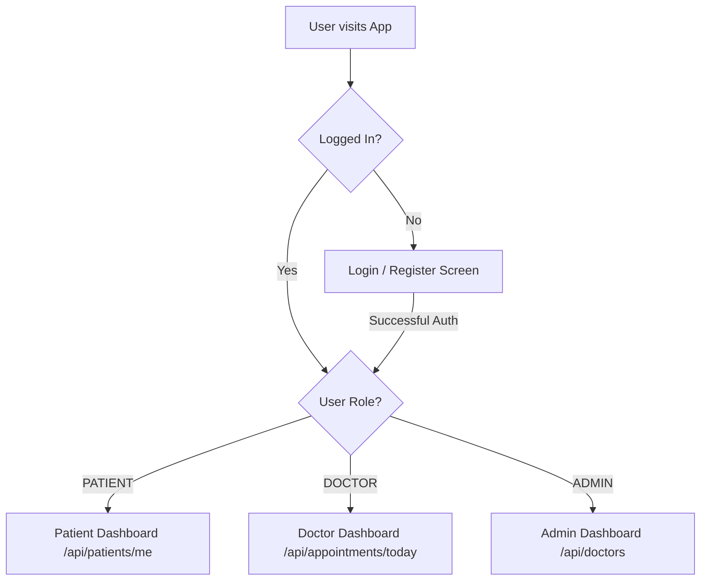

# Frontend Integration & Architecture Guide

This guide details the specifications, routing rules, screen layouts, and API integrations required to build a modern frontend (e.g., React, Next.js, Vue, or Angular) that consumes the Clinic Appointment Booking REST API.

---

## 🛠 Recommended Tech Stack
* **Framework:** React 18+ or Next.js 14+ (App Router)
* **Language:** TypeScript (for type safety with API payloads)
* **Styling:** TailwindCSS + Shadcn/ui (for accessible, polished UI components)
* **State Management & Server Cache:** TanStack Query (React Query) + Axios (handles automatic data refetching and caching)

---

## 🔑 Authentication & Token Management
On successful login (`POST /api/auth/login`), the backend returns a JWT access token and user role details.

### 1. Token Storage
* Store the JWT in a secure state (or `localStorage`/`sessionStorage` for SPA client-side requests, or HttpOnly Cookies if using Next.js Server Components).
* Inject the token into the headers of all secure requests:
  ```http
  Authorization: Bearer <your_jwt_token>
  ```

### 2. Client-Side Axios Instance Setup
Create a reusable HTTP helper with an interceptor to automatically attach the token:

```typescript
import axios from 'axios';

const api = axios.create({
  baseURL: process.env.NEXT_PUBLIC_API_URL || 'http://localhost:8080',
  headers: {
    'Content-Type': 'application/json',
  },
});

api.interceptors.request.use((config) => {
  const token = localStorage.getItem('token');
  if (token) {
    config.headers.Authorization = `Bearer ${token}`;
  }
  return config;
}, (error) => {
  return Promise.reject(error);
});

export default api;
```

---

## 🛡 Routing & Role-Based Access Control (RBAC)

Below is the user navigation flow based on role-based path guards:



### Route Protections:
* **Public Routes:** `/login`, `/register`
* **Patient Guards (Role: `PATIENT`):** `/dashboard`, `/book-appointment`, `/profile`
* **Doctor Guards (Role: `DOCTOR`):** `/doctor/appointments`, `/doctor/availability`
* **Admin Guards (Role: `ADMIN`):** `/admin/users`, `/admin/doctors`, `/admin/appointments`

---

## 🖥 Screen Specifications & Endpoints

### 1. Authentication Screens
* **Registration Page:** Collects `fullName`, `email`, `password`, `phone`, and `role`. 
  * *Endpoint:* `POST /api/auth/register`
* **Login Page:** Collects `email` and `password`. On success, save token and user context, then redirect to the dashboard.
  * *Endpoint:* `POST /api/auth/login`

### 2. Patient Dashboard & Booking Flow
* **Home Page:** Displays a user-friendly queue of the patient's upcoming and past bookings.
  * *Endpoint:* `GET /api/appointments/me`
* **Profile Setup:** If a new patient logs in, prompt them to fill out their profile.
  * *Endpoint:* `POST /api/patients` (Fields: `gender`, `dateOfBirth`, `address`, `bloodGroup`, `emergencyContact`)
* **Booking Page:**
  1. Search doctors by specialization/name: `GET /api/doctors?specialization=x&name=y`
  2. Fetch doctor availability schedules: `GET /api/availabilities/doctor/{doctorId}/active`
  3. Let the user choose a future date and time slot within the doctor's schedules.
  4. Submit the booking request: `POST /api/appointments`

#### Handling Booking Conflicts (409 Conflict):
If a patient attempts to book an overlapping slot or a slot that is full/outside availability, the backend will return `HTTP 409 Conflict`. Show a clean alert to the user:

```typescript
try {
  await api.post('/api/appointments', {
    doctorId: 1,
    appointmentDate: '2026-07-06',
    appointmentTime: '10:30:00',
    notes: 'Heart Checkup'
  });
  // Show success modal
} catch (error: any) {
  if (error.response && error.response.status === 409) {
    alert(`Scheduling Conflict: ${error.response.data.message}`);
  } else {
    alert('An unexpected error occurred. Please try again.');
  }
}
```

### 3. Doctor Dashboard
* **Today's Queue:** Displays list of patients scheduled for the current day.
  * *Endpoint:* `GET /api/appointments/today`
* **Availability Planner:** A calendar interface allowing doctors to create, toggle (active/inactive), and delete weekly time blocks.
  * *Endpoints:*
    * Create: `POST /api/availabilities`
    * Update: `PUT /api/availabilities/{id}`
    * Delete: `DELETE /api/availabilities/{id}`
* **Appointment Rescheduler:** Modal to reschedule or cancel a booking.
  * *Endpoints:*
    * Reschedule: `PUT /api/appointments/{id}/reschedule`
    * Cancel: `PUT /api/appointments/{id}/cancel`

### 4. Admin Dashboard
* **Doctor List Management:** Add, edit, or delete doctors.
  * *Endpoints:* `POST /api/doctors`, `PUT /api/doctors/{id}`, `DELETE /api/doctors/{id}`
* **System Queue Monitor:** Monitor all active appointments across the system.
  * *Endpoint:* `GET /api/appointments/me` (As Admin, this returns all records in the system)
